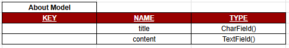
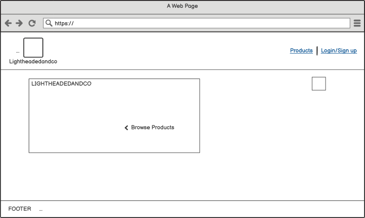
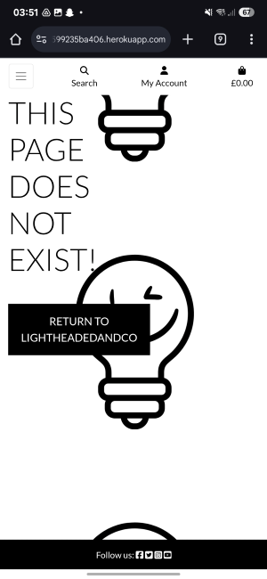

# **LIGHTHEADEDANDCO ECOMMERCE PLATFORM**
Amiresponsiveimagelink here

# INTRODUCTION
The Lightheadedandco site has been created as an online hat store where users can view and purchase a variety of hats.

To view the site please follow the link below:

[Lightheadedandco Site]()

# CONTENTS

- [OBJECTIVES](#objectives)
  - [Site Owner Goals](#site-owner-goals)
  - [Visitor Goals](#visitor-goals)
     - [First Time Visitors](#first-time-visitors)
     - [Returning Visitors](#returning-visitors)
  - [Business Model](#business-model)
  - [Marketing Techniques](#marketing-techniques)
  - [Project Management](#project-management)
    - [Github Projects](#github-projects)
    - [Models Used](#models-used)

- [USER EXPERIENCE](#user-experience)
  - [User Stories](#user-stories)
  - [Wireframes](#wireframes)
  - [Site Structure](#site-structure)
  - [Design Choices](#design-choices)  

- [FEATURES](#features)
  - [Main Features](#main-features)
    - [Navbar](#navbar)
    - [Homepage](#homepage)
    - [Product List](#product-list)
    - [Product Detail](#product-detail)
    - [About Us](#about-us)
      - [About Section](#about-section)
      - [Bookings Section](#bookings-section)
    - [User Profiles](#user-profiles)
      - [Register](#register)
      - [Login](#login)
      - [Log out](#log-out)
      - [Wishlist](#wishlist)
      - [Order History](#order-history)
      - [Product Management](#product-management)
    - [Message Alerts](#message-alerts)
    - [Error Page](#error-page)
  - [Future Features](#future-features)

- [TECHNOLOGIES USED](#technologies-used)

- [TESTING](#testing)
  - [Manual Testing](#manual-testing)
  - [External Testing](#external-testing)
  - [Performance & Accessibility](#performance--accessibility)
  - [Validator Testing](#validator-testing)
  - [Troubleshooting](#troubleshooting)

- [PROJECT DEPLOYMENT](#project-deployment)
  - [Deployment to Heroku](#deployment)  
  - [How to fork the repository from Github](#how-to-fork-the-repository-from-github)
  - [How to clone the project](#how-to-clone-the-project)

- [CREDIT](#credit)
  - [Content Credits](#content-credit)
  - [Media Credts](#media-credits)
  - [Acknowledgements](#acknowledgements)

# OBJECTIVES
The aim for this ecommerce site is for users to be able to view and purchase a number of different hats which have been added by the Admin.
Users are also encouraged to create an account so they can leave testimonials, and add items to their wishlist which is accessible in their profile.

[Back to top](#contents)

## SITE OWNER GOALS
The aim is for the admin to have full control over what is displayed on the website and be able to update its contents they want.
The site’s admin has access to the admin panel where they can upload products to their site and add descriptions for them. From here they can also access the content displayed on the About page, as well as approving any testimonials submitted by users.

[Back to top](#contents)

## VISITOR GOALS
Users visiting the site will be able to create an account and log into it, view and search for products, visit the About page, and submit testimonials which the Admin will review. 
Users who view a specific product are able to add this item to their bag and complete a purchase.
[Back to top](#contents)

### FIRST TIME VISITORS
When users first visit the site the homepage will be displayed. From here they can use the navbar to navigate over to the products section or the About us page. 
From the navbar they can also follow the link to register and create an account. Once an account is created they can access their wishlist and leave testimonials.
[Back to top](#contents)

### RETURNING VISITORS
Users who have already visited the site and created an account will be able to log into it. They will also see a message displayed informing them of their log in status.
[Back to top](#contents)

## BUSINESS MODEL

[Back to top](#contents)

## MARKETING TECHNIQUES

[Back to top](#contents)

## PROJECT MANAGEMENT

### GITHUB PROJECTS
Github Projects was used to plan and keep track of the project's development.

A link to the Project site can be found below:

- [LIGHTHEADEDANDCO](https://github.com/users/JoeOrtiz1995/projects/8/views/1)

The Kanban Board helped to keep track of user stories, acceptance criteria, and which tasks to work on at a time.

### MODELS USED

<b>Products App</b>

 

<b>Bag App</b>

 

<b>Checkout App</b>

 

<b>About App</b>

 

<b>Profile App</b>

 

[Back to top](#contents)

# USER EXPERIENCE

## USER STORIES
Before adding to the Kanban board, all the user stories were documented in a Google Sheet.
- [User Stories](readme/assets/documents/User_stories_helper_doc.pdf)
These were then assigned labels using Github Issues and assigned a priority using MoSCoW.

- [Github Issues]()

[Back to top](#contents)

## WIREFRAMES
The initial wireframes for the site were created using [Balsamiq](https://balsamiq.com/wireframes/).

<b>Balsamiq Wireframes</b>

 

The site didn't end up looking quite like the wireframes were set up, however they still helped visualise a basic layout for the website.

[Back to top](#contents)

## SITE STRUCTURE
The site is set out so that users land on the homepage when they first visit. From here they can use the Navbar to navigate to the different sections of the site.
All users can navigate the site and complete purchases, however only users who have created an account and are logged in can leave testimonials or access their profile to view their Order History and Wishlist.

1. [Products](#products)
2. [About Us](#about-us)
3. [Profile](#profile). 
4. [Admin Site](#admin-site)

[Back to top](#contents)

## DESIGN CHOICES
The colour scheme used in the design was inspired by the Lightheadedandco logo. It uses a very simple light theme which was chosen to make the lights in the LED hats stand out more.

[coolors website](https://coolors.co/) was used to create the palette below.

<b>Lightheaded Colour Scheme</b>

 

[Back to top](#contents)

# FEATURES

## MAIN FEATURES

### NAVBAR
NAVBAR
D-block & d-lg-none attributes hides the links on large screens (where they’ll be in the top bit of header), and only show on small screens
Search form is in a dropdown format
To improve layout on mobile devices the profile bit is a dropdown menu - ADD WISHLIST HERE 
To improve layout on mobile devices 3rd button is to access
Added icon to navbar which is hidden on mobile view
Add menu options to Profile dropdown for wishlist and My orders. 

From the navbar a user can see whether they are logged in or not.

[Back to top](#contents)

### HOMEPAGE
When users visit the site, they will land on the homepage. 
The structure for the homepage is very simple and contains a navbar with links for users to access the different pages of the site and log in or create an account.
The homepage also has a button which takes users directly to the products list page.

[Back to top](#contents)

### PRODUCTS
There are two dropdown options on the navbar from which users can access the products page.
This allows them to view all products in a specific category, as well as giving them the choice to view products sorted in various ways. 
From the products list page, users have different options to sort the products. This allows users more control and clarity over what they are seeing.
The page is set up to be responsive across different screen sizes, 

They are able to click on any event, and this will take them to that event's page.

[Back to top](#contents)

### INDIVIDUAL PRODUCTS
This page displays to the users a specific product’s information. From here they can add the product to their bag and choose the quantity.
On this page a users will see a full description of each products they've clicked on. 

Only Admins are able to create, edit and delete events. They also have the ability to approve comments. 

Once a comment is approved it will be visible to all users who visit that event's page regardless if they're logged in or not.

#### EVENT DESCRIPTION
This section contains the event's description below a banner with the event's date and a photo of the restaurant. Each event has its own description and users are encouraged to comment what they think.

#### COMMENT SECTION
The Comment section is below the event's description. 

What users see will depend on their log in status. If they're not logged in they are able to see approved comments, but a message displayed will let them know that only logged in users are able to leave a comment.

Logged in users will also be able to see all the approved comments as well as any unapproved comments they have posted. Users are able to edit and delete any of their comments.

- #### ADDING COMMENTS
Only a logged in user is able to add comments, and a message is displayed to make them aware. 

- #### EDITING COMMENTS
Logged in users are also able to edit their own comments. If they edit an approved comment, this new edited comment would not be automatically approved and would have to be reviewed and approved by an admin first.

- #### DELETING COMMENTS
Logged in users are able to delete their comments. When looking to delete a comment they will be asked to confirm their decision before the deletion is carried. This was done so as to minimise any unintended deletions.

 

[Back to top](#contents)

### BOOKINGS
This page contains the About section and the form for users to submit a booking request.

#### ABOUT US
The About us page contains information on Lightheadedandco and a section for testimonials. Users will see all approved testimonials as a list, and they can leave testimonials if they have an account and are logged in.

Admins can edit the text through the admin panel, and the page has been set up so that only the most recent updated version is shown.

#### TESTIMONIALS
Logged in users are able to submit testimonials when they visit the About us page.

- #### SUBMIT A TESTIMONIAL
Only users who are logged in can submit testimonials. The admin can access them in the Admin Panel and from here they can be reviewed. 
Any approved testimonials will be displayed to users on the About us page, regardless of their login status. 
Users who have submitted a testimonial which hasn’t been approved by the admin will see a message to confirm this.

[Back to top](#contents)

## USER PROFILES
A message displayed to users across all pages lets them know whether they're logged in or not.

### REGISTER
When a user visits the registration page they will be asked for a Username and Password. Once they've created the account they'll be redirected back to the homepage.

There are links to the Login page for users who already have an account.

### LOGIN
If a user has registered previously they will be able to log in using the link on the nav bar, however they can also use the Remember Me feature so they are automatically logged in whenever they visit the site.

### LOG OUT
Once a user has registered and/or logged into their account, they will have a link in the nav bar to log out.

### ADMIN PANEL
Verbose name added to Categories model for clarity.
This site was created with the intention of staff being able to review the content displayed on their site. 

From here they can:
- Add, view, edit and delete events.
- Review comments by submitted by users.
- Approve booking requests.
- Update the About section's content.

This gives them full CRUD capabilities on the site. Some of the fields staff are able to amend have been improved by implementing Summernote, which enables rich-text editing.

[Back to top](#contents)

## MESSAGE ALERTS
Whenever a user submits a request such as leaving or editing a comment, or sending a booking form, a message will appear on the screen to let them know if it has been possible.

<b>User Messages on Booking Form</b>

 

<b>User messages when editing or deleting Comments</b>

 

## ERROR PAGE
A user would only see this page if an incorrect URL is entered. They will see a message on the page and a button to take them back to the home page. The Navbar links also work the same here as they do throughout the site.

[Back to top](#contents)

## FUTURE FEATURES
There are a number of features which unfortunately have not been able to be implemented at this stage such as:

- Users being able to delete their account.

[Back to top](#contents)

# TECHNOLOGIES USED

## LANGUAGES
- [Python](https://en.wikipedia.org/wiki/Python_(programming_language)) - Provides the functionality for the site.

- [HTML5](https://en.wikipedia.org/wiki/HTML) - Provides the content and structure for the website.

- [CSS3](https://en.wikipedia.org/wiki/CSS) - Provides the styling for the website.

- [JavaScript](https://en.wikipedia.org/wiki/JavaScript) - Provides interactive elements of the website

[Back to top](#contents)

## FRAMEWORKS & SOFTWARE
- [Django](https://www.djangoproject.com/) - A model-view-template framework used to create the site.

- [Bootstrap](https://getbootstrap.com/) - A CSS framework that helps building solid, responsive websites.

- [Balsamiq](https://balsamiq.com/) - Used to create the wireframe.

- [Google Sheets](https://docs.google.com/spreadsheets/create) - Used to log the User Stories.

- [Google Docs](https://docs.google.com/) - Used to start planning the project and keeping notes on it.

- [Github](https://github.com/) - Used to host and edit the website.

- [Gitpod](https://www.gitpod.io) used to push changes to the GitHub repository.

- [Heroku](https://en.wikipedia.org/wiki/Heroku) - A cloud platform that the application is deployed to.

- [Lighthouse](https://developer.chrome.com/docs/lighthouse/overview/) - Used to test performance of site.

- [VSCode](https://code.visualstudio.com/) - Used to create and edit the site.

- [Google Chrome DevTools](https://developer.chrome.com/docs/devtools/) - Used to debug and test responsiveness.

- [HTML Validation](https://validator.w3.org/) - Used to validate HTML code

- [CSS Validation](https://jigsaw.w3.org/css-validator/) - Used to validate CSS code

- [PEP8 Validation](http://pep8online.com/) - Used to validate Python code.

- [JSHint Validation](https://jshint.com/) - Used to validate JavaScript code

[Back to top](#contents)

# TESTING

## TESTING USER STORIES
A complete list of the User Stories can be found here: 

- [User Stories Log]()

[Back to top](#contents)

## CODE VALIDATION
The code was ran on the following validation sites:

- [HTML Validation](https://validator.w3.org/) - Ran and returned no errors

<b>HTML Validator Results</b>

 

- [CSS Validation](https://jigsaw.w3.org/css-validator/) - Ran and returned no errors

- [PEP8 Validation](http://pep8online.com/) - The Views, Admin, Model and Form files were checked using the CI Python Linter.

- [JSHint Validation](https://jshint.com/) - Running the comments.js file returned just one error. There is an undefined variable connected to Bootstrap, however this is not an issue.

[Back to top](#contents)

## PERFORMANCE & ACCESSIBILITY TESTS

### LIGHTHOUSE CHECKS

<b>Lighthouse Results</b>

 

### BROWSER COMPATIBILITY
The application was tested on the following browsers and it ran without any issues:

- Google Chrome

- Microsoft Edge

- Mozilla Firefox

[Back to top](#contents)

## TROUBLESHOOTING & BUGS

[Back to top](#contents)

# PROJECT DEPLOYMENT

## DEPLOYMENT TO HEROKU
The full application was deployed using the [Heroku Website](https://heroku.com/).

The steps taken to deploy the application were as follows:

1. Accessed the Heroku website and logged into my account. If you don't have an account you can follow [this link](https://signup.heroku.com/login) to create one.

2. On the dashboard click on "New", and then "Create new app".

3. I chose an app name (lightheadedandco), changed the region to "Europe" and clicked "Create app".

4. Once this is done, navigate over to the "Settings" section and click on "Reveal Config Vars". Enter any config vars required.

5. Go back over to the "Deploy" section and link your GitHub account by clicking on the GitHub button. Sign in to your GitHub account if necessary, and once this is done type the name of the repository you want to deploy and search for it using the Search button. Once you've found it press "Connect". This will link the Heroku app to the code in GitHub.

7. There are two ways of finalising the application's deployment. At the bottom of the "Deploy" section, you will find an "Automatic deploys" and a "Manual deploy" subsection and you'll have to choose which method you'd prefer. The main difference between these options is that the Manual deploy option deploys the application by running the current code, however if any changes are made these will not be reflected until another Manual deploy is actioned. I've added links for further information about both of these options below.

    - [Heroku Automatic Deploys](https://devcenter.heroku.com/articles/github-integration#automatic-deploys)

    - [Heroku Manual Deploys](https://devcenter.heroku.com/articles/github-integration#manual-deploys)

8. On this occasion I chose the Manual deploys option.

9. Once the deployment has finished, a message will appear to confirm this above a button that says "View" which will take you to the deployed application. You can also click on open app at the top of the Page.

[Back to top](#contents)

## HOW TO FORK THE REPOSITORY FROM GITHUB
The steps required to fork [this repository](https://github.com/JoeOrtiz1995/Lightheadedandco) are listed below:

1. Follow the link above to locate my original repository.

2. In the code section, there is a button that says "Fork" located just above the "About" section.

3. Click on this button and the fork will be created.

[Back to top](#contents)

## HOW TO CLONE THE PROJECT
To clone this project follow the steps listed below:

1. Navigate over to [this repository](https://github.com/JoeOrtiz1995/Lightheadedandco) and click on the green "Code" button located next to "Add file".

2. From the dropdown copy the URL link. This can be done using the copy button next to the link or by highlighting it and copying it.

3. Within the IDE open Git Bash, and change the working directory's location to the one you want to work off, at which point the cloned directory will be created.

4. Type "git clone", and paste the URL copied in step 1 and the clone will be created.

[Back to top](#contents)

# CREDIT
## CONTENT CREDIT
The concept for this project came from one of my friends who is looking to start a business selling LED hats, and he kindly shared the images for the LED hats and the logo.
The content was created by myself, however I did rely on the Boutique Ado Walkthrough to help with the building process.

[Back to top](#contents)

## MEDIA CREDITS
Most of the other pictures used came from [Freeimages](https://www.freeimages.com/):

- [Freeimages Black Hat](https://www.freeimages.com/photo/black-hat-1417068)

- [Freeimages Straw Hat](https://www.freeimages.com/download/hat-1418845)

- [Freeimages Party Hat](https://www.freeimages.com/photo/party-hat-1421020)

- [Freeimages Old Hat](https://www.freeimages.com/photo/old-hat-1421327)

- [Freeimages Western Hat](https://www.freeimages.com/photo/western-hat-4-1419723)

- [Freeimages Cowboy Hat](https://www.freeimages.com/photo/cowboy-hat-1419050)

The hats used in the Kds section came from [Freepik](https://www.freepik.com/):

- [Freepik](https://www.freepik.com/free-photo/pretty-blue-hat_976050.htm#from_view=detail_alsolike)

- [Freepik](https://www.freepik.com/free-psd/studio-portrait-young-girl-with-red-beanie_38077038.htm#fromView=search&page=1&position=2&uuid=a6eba289-42be-439d-adda-42c9ef2c806d&new_detail=true)

- [Freepik](https://www.freepik.com/free-photo/blue-winter-knit-ski-hat-isolated-white_21128648.htm#from_view=detail_alsolike)

Baseball cap photos credits:

Photo by Ahmed Syed on (https://unsplash.com/photos/man-in-gray-cap-6NVrH0HB_DE?utm_content=creditCopyText&utm_medium=referral&utm_source=unsplash)
Photo by Case Hubbart on (https://unsplash.com/photos/four-assorted-fitted-caps-on-shelf-nEd_14IuaZE?utm_content=creditCopyText&utm_medium=referral&utm_source=unsplash)
[Back to top](#contents)

## ACKNOWLEDGEMENTS
I would like to personally thank my Mentor, [Precious Ijege](https://www.linkedin.com/in/precious-ijege-908a00168/) for his support and feedback during the building process. His suggestions and comments on the application and how to improve it helped me have the confidence to go further and test my knowledge.

A further acknowledgement to [Worldofmarcus](https://github.com/worldofmarcus) as their [README](https://github.com/worldofmarcus/project-portfolio-5/blob/main/README.md) file was a great tool to help me set out the structure for mine.

I would also like to thank the Student Support Team at [Code Institute](https://www.codeinstitute.net) for their assistance throughout the course. 

[Back to top](#contents)
