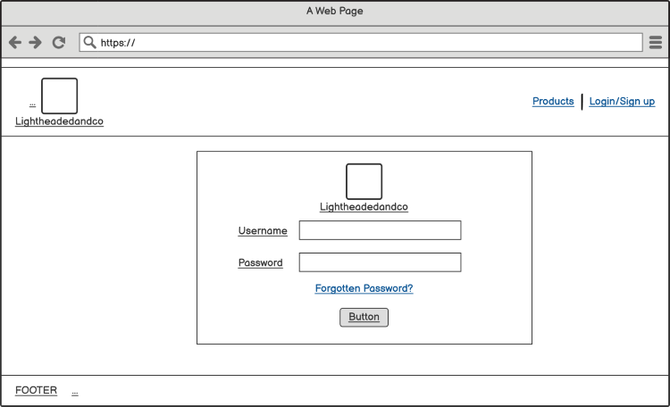
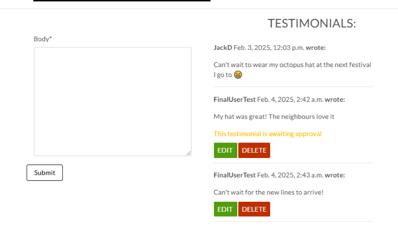

# **LIGHTHEADEDANDCO ECOMMERCE PLATFORM**

# INTRODUCTION
The Lightheadedandco site has been created as an online hat store where users can view and purchase a variety of hats.

To view the site please follow the link below:

[Lightheadedandco Site](https://lightheadedandco-9599235ba406.herokuapp.com/)

# CONTENTS

- [OBJECTIVES](#objectives)
  - [Site Owner Goals](#site-owner-goals)
  - [Visitor Goals](#visitor-goals)
     - [First Time Visitors](#first-time-visitors)
     - [Returning Visitors](#returning-visitors)
  - [Business Model](#business-model)
  - [Marketing Techniques](#marketing-techniques)
  - [Project Management](#project-management)
    - [Github Projects](#github-projects)
    - [Models Used](#models-used)

- [USER EXPERIENCE](#user-experience)
  - [User Stories](#user-stories)
  - [Wireframes](#wireframes)
  - [Site Structure](#site-structure)
  - [Design Choices](#design-choices)  

- [FEATURES](#features)
  - [Main Features](#main-features)
      - [Navbar](#navbar)
      - [Footer](#footer)
    - [Homepage](#homepage)
    - [Products](#products)
      - [Product List](#product-list)
      - [Product Detail](#product-detail)
    - [About Us](#about-us)
      - [About Section](#about-section)
      - [Testimonials Section](#testimonials-section)
    - [Bag](#bag)
    - [Checkout](#checkout)
    - [User Profiles](#user-profiles)
      - [Product Management](#product-management)
      - [Register](#register)
      - [Login](#login)
      - [Log out](#log-out)
      - [Wishlist](#wishlist)
      - [Order History](#order-history)
    - [Message Alerts](#message-alerts)
    - [Error Page](#error-page)
  - [Future Features](#future-features)

- [TECHNOLOGIES USED](#technologies-used)

- [TESTING](#testing)
  - [Manual Testing](#manual-testing)
  - [External Testing](#external-testing)
  - [Performance & Accessibility](#performance--accessibility)
  - [Validator Testing](#validator-testing)
  - [Troubleshooting](#troubleshooting)

- [PROJECT DEPLOYMENT](#project-deployment)
  - [Deployment to Heroku](#deployment)  
  - [How to fork the repository from Github](#how-to-fork-the-repository-from-github)
  - [How to clone the project](#how-to-clone-the-project)

- [CREDIT](#credit)
  - [Content Credits](#content-credit)
  - [Media Credts](#media-credits)
  - [Acknowledgements](#acknowledgements)

# OBJECTIVES
The aim for this ecommerce site is for users to be able to view and purchase a number of different hats which have been added by the Admin.

Users are encouraged to create an account so they can leave testimonials and add items to their wishlist which is accessible in their profile.

[Back to top](#contents)

## SITE OWNER GOALS
The aim for the admin is to have full control over what is displayed on the website and be able to update any content theyon it.

The site’s admin has access to the admin panel where they can upload products to the site and add descriptions for them. From here they can also access the content displayed on the About page, as well as approving any testimonials submitted by users.

[Back to top](#contents)

## VISITOR GOALS
Users who have already created an account can log into it, add any product they see on the site to their personal wishlist and submit testimonials for the Admin to review.

Users with an account are also able to view previous orders made on the site and update their profile's details.

[Back to top](#contents)

### FIRST TIME VISITORS
When users first visit the site, they will land on the homepage. The layout is very simplistic and users can navigate the site using the links in the navbar, or proceed directly to the products page by clicking on the "View Headwear" button.

There are prompts throughout the site to encourage users to create an account. For example when a user is viewing products, if they access and look at a particular product's description they will see that the product they are currently on could be added to their wishlist if they had an account. The same prompt is used in the About us section, where users can view all the approved testimonials, but they can only submit one if they have an account.

### RETURNING VISITORS
Users who have already visited the site and created an account will be able to log into it. They will also see a message displayed informing them of their log in status.

They will be able to access their profile to view and update their details, view their order history, view their wishlist and submit testimonials.

[Back to top](#contents)

## BUSINESS MODEL
The business model for Lightheadedandco is purely B2C based. Lightheadedandco will cater to the general public, and as such anyone who visits the site could be a potential customer.

One of the first things users will see is a form on the site's homepage encouraging them to sign up to the newsletter. The intention is to increase potential visits to the site, which should ultimately also increase the sales.

Included at the bottom of the homepage users will also see links from which they can access the company's Facebook Page

The site is built with the idea of making the admin's job as easy as possible should they want to amend, add or delete any of the content. This ensures that any changes can be carried out as easily as possible with a minimum impact to the business model.

[Back to top](#contents)

## MARKETING TECHNIQUES
The main marketing technique used for this application is an email subscription. Users will see on the homepage a form where they can enter their email to receive updates on new products. The aim here is to increase user engagement and visits to the site. 

When users are notified of something new they haven't seen before, the likelihood is that they will want to visit the site so they can view these new items and hopefully complete a purchase or add them to their wishlist.

[Back to top](#contents)

## PROJECT MANAGEMENT

### GITHUB PROJECTS
Github Projects was the platform used to set up tasks and keep track of the project's development.

A link to the Project site can be found below:

- [LIGHTHEADEDANDCO](https://github.com/users/JoeOrtiz1995/projects/8/views/1)

The Kanban Board helped to keep track of user stories, acceptance criteria, and which tasks to work on at a time.

### MODELS USED

<b>About App</b>

 

<b>Checkout App</b>

 

<b>Products App</b>

 

<b>Profile App</b>

 

[Back to top](#contents)

# USER EXPERIENCE

## USER STORIES
User stories were initially documented in a Google Sheet which is linked below:

- [User Stories](readme/assets/documents/user_stories.pdf)

These were then prioritised using the MoSCoW method and assigned labels using Github Issues.

- [Github Issues](https://github.com/JoeOrtiz1995/Lightheadedandco/labels)

[Back to top](#contents)

## WIREFRAMES
The initial wireframes for the site were created using [Balsamiq](https://balsamiq.com/wireframes/).

<b>Balsamiq Wireframes</b>

 

The site didn't end up looking quite like the wireframes were set up, however they still helped visualise a basic layout for the website.

[Back to top](#contents)

## SITE STRUCTURE
The site's structure can be split into four main sections:

1. [Products](#products)
2. [About Us](#about-us)
3. [Profile](#profile)
4. [Admin Site](#admin-site)

All users can navigate the site and complete purchases, however only users who have created an account and are logged in can leave testimonials or access their profile to view their Order History and Wishlist.

[Back to top](#contents)

## DESIGN CHOICES
The colour scheme used in the design was inspired by the Lightheadedandco logo. It uses a very simple light theme which was chosen as it makes the colourful products listed stand out more - especially the LED hats.

- [LED Hats](readme/assets/images/led_hats.png)

[Back to top](#contents)

# FEATURES

## MAIN FEATURES

### NAVBAR
The Navbar is what users will mainly use when navigating the site. 

If nothing is entered into the searchbar, the user will be taken to the products list page rather than display an error. If the user does search for something, they will be able to see all products containing what is being searched, even if they appear only on a product's description. This improves a User's experience on the site, as what they are looking for might not always match a product's name.

If a user has an item in their bag, the total is displayed and they can access it via the link in the Navbar.

Users can also use the Navbar to visit the About Us page, log in to their account or sign up to create a new one.

The Navbar's layout and display is set up to act as a dropdown menu on Mobiles.

### FOOTER
The footer is displayed on most pages a user will see when navigating the site.

From here Users can follow the links to the Business Facebook Page. Further links will be added in future.

### HOMEPAGE
When users visit the site, they will land on the homepage. 

The structure for the homepage is very simple and contains a the navbar and a button which takes users directly to the products list page without having to access the navbar links.

Users will also find the newsletter sign-up form on the homepage.

[Back to top](#contents)

### PRODUCTS

#### PRODUCTS LIST
There are two dropdown options on the navbar from which users can access the products page.

This allows them to view all products in a specific category, as well as giving them the choice to view products sorted in various ways.

Users are also able to sort the products on the products list page, allowing for more control over what they are seeing.

Admins are able to edit or delete products directly from this page, as long as they are logged in.

The page is set up to be responsive across different screen sizes.

#### PRODUCT DETAIL
This page displays a specific product’s information and from here users can add the item to their bag. The quantity buttons are set up so that users can't add less than 1 item or more than 99 to their bag.

Users are also able to add items to their wishlist from this page. If a user isn't logged in they will see a message stating they need to have an account to add items to a wishlist. If a user is logged in and they have the item in their wishlist, the "Add to Wishlist" button is disabled and the text displayed will tell the user that they already have this item in their wishlist, and includes a link so they can access it withouth having to use the navbar.

[Back to top](#contents)

### ABOUT US

#### ABOUT
The About us page contains information on Lightheadedandco and a section for testimonials.

Admins can edit the About section's content through the admin panel, and the page has been set up so that only the most recent updated version is shown.

Users will see all approved testimonials as a list, and they can leave testimonials if they have an account and are logged in.

#### TESTIMONIALS
Logged in users are able to submit testimonials when they visit the About us page.

All testimonials submitted will have to be approved by the admin before they're visible to all users. Users are able to edit and delete their own testimonials.

Any approved testimonials will be displayed to users on the About us page, regardless of their login status. However, users who aren't logged in will still be able to see approved testimonials, but instead of the text box they'll see a message with links to the sign-up pages.

Users who have submitted a testimonial which hasn’t been approved by the admin will see a message stating it's being reviewed.

[Back to top](#contents)

### BAG
Users who navigate to the Bag section without having anything added will see a mesage stating this, and will be redirected to the products page.

[Back to top](#contents)

### CHECKOUT
The 

[Back to top](#contents)

## USER PROFILES
A message displayed to users across all pages lets them know whether they're logged in or not.

### REGISTER
When a user visits the registration page they will be asked for a Username and Password. Once they've created the account they'll be redirected back to the homepage.

There are links to the Login page for users who already have an account.

### LOGIN
If a user has registered previously they will be able to log in using the link on the nav bar, however they can also use the Remember Me feature so they are automatically logged in whenever they visit the site.

### LOG OUT
Once a user has registered and/or logged into their account, they will have a link in the nav bar to log out.

### ADMIN PANEL

*****All the information, images and pricing can be updated by the admin. They can do this directly on the site, or by accessing the admin panel. They are also able to add and delete products directly.*****

Verbose name added to Categories model for clarity.
This site was created with the intention of staff being able to review the content displayed on their site. 

From here they can:
- Add, view, edit and delete events.
- Review comments by submitted by users.
- Approve booking requests.
- Update the About section's content.

This gives them full CRUD capabilities on the site. Some of the fields staff are able to amend have been improved by implementing Summernote, which enables rich-text editing.

[Back to top](#contents)

## MESSAGE ALERTS
Whenever a user submits a request such as leaving or editing a comment, or sending a booking form, a message will appear on the screen to let them know if it has been possible.

<b>User Messages on Booking Form</b>

 

<b>User messages when editing or deleting Comments</b>

 

## ERROR PAGE
A user would only see this page if an incorrect URL is entered. They will see a message on the page and a button to take them back to the home page. The Navbar links also work the same here as they do throughout the site.

[Back to top](#contents)

## FUTURE FEATURES
There are a number of features which unfortunately have not been able to be implemented at this stage such as:

- Users being able to delete their account.

[Back to top](#contents)

# TECHNOLOGIES USED

## LANGUAGES
- [Python](https://en.wikipedia.org/wiki/Python_(programming_language)) - Provides the functionality for the site.

- [HTML5](https://en.wikipedia.org/wiki/HTML) - Provides the content and structure for the website.

- [CSS3](https://en.wikipedia.org/wiki/CSS) - Provides the styling for the website.

- [JavaScript](https://en.wikipedia.org/wiki/JavaScript) - Provides interactive elements of the website

[Back to top](#contents)

## FRAMEWORKS & SOFTWARE
- [Django](https://www.djangoproject.com/) - A model-view-template framework used to create the site.

- [Bootstrap](https://getbootstrap.com/) - A CSS framework that helps building solid, responsive websites.

- [Balsamiq](https://balsamiq.com/) - Used to create the wireframe.

- [Google Sheets](https://docs.google.com/spreadsheets/create) - Used to log the User Stories.

- [Google Docs](https://docs.google.com/) - Used to start planning the project and keeping notes on it.

- [Github](https://github.com/) - Used to host and edit the website.

- [Gitpod](https://www.gitpod.io) used to push changes to the GitHub repository.

- [Heroku](https://en.wikipedia.org/wiki/Heroku) - A cloud platform that the application is deployed to.

- [Lighthouse](https://developer.chrome.com/docs/lighthouse/overview/) - Used to test performance of site.

- [VSCode](https://code.visualstudio.com/) - Used to create and edit the site.

- [Google Chrome DevTools](https://developer.chrome.com/docs/devtools/) - Used to debug and test responsiveness.

- [HTML Validation](https://validator.w3.org/) - Used to validate HTML code

- [CSS Validation](https://jigsaw.w3.org/css-validator/) - Used to validate CSS code

- [PEP8 Validation](http://pep8online.com/) - Used to validate Python code.

- [JSHint Validation](https://jshint.com/) - Used to validate JavaScript code.

- [AWS](https://aws.amazon.com/) - Used to store static and media folders and files.

- [Mailchimp](https://mailchimp.com/) - Used to create the sign up form.

- [Stripe](https://stripe.com/gb) - Used to process payments 
 and to test the checkout process worked.

[Back to top](#contents)

# TESTING

## TESTING USER STORIES
A complete list of the User Stories can be found here: 

- [User Stories Log](readme/assets/documents/user_stories.pdf)

[Back to top](#contents)

## CODE VALIDATION
The code was ran on the following validation sites:

- [HTML Validation](https://validator.w3.org/) - Ran and returned no errors

- [CSS Validation](https://jigsaw.w3.org/css-validator/) - Ran and returned no errors

 

- [PEP8 Validation](http://pep8online.com/) - The full app was checked against PEP8 requirements and meets them. However the migration files and the settings file do show up as having lines longer than 79 characters. I have been unable to fix this issue on the settings file, as modifying this line prevents heroku from deploying the application.

- [JSHint Validation](https://jshint.com/) - Running the comments.js file returned no errors.

[Back to top](#contents)

## PERFORMANCE & ACCESSIBILITY TESTS

### LIGHTHOUSE CHECKS

<b>Lighthouse Results</b>

 

### BROWSER COMPATIBILITY
The application was tested on the following browsers and it ran without any issues:

- Google Chrome

- Microsoft Edge

- Mozilla Firefox

[Back to top](#contents)

## TROUBLESHOOTING & BUGS

[Back to top](#contents)

# PROJECT DEPLOYMENT

## DEPLOYMENT TO HEROKU
The full application was deployed using the [Heroku Website](https://heroku.com/).

The steps taken to deploy the application were as follows:

1. Accessed the Heroku website and logged into my account. If you don't have an account you can follow [this link](https://signup.heroku.com/login) to create one.

2. On the dashboard click on "New", and then "Create new app".

3. I chose an app name (lightheadedandco), changed the region to "Europe" and clicked "Create app".

4. Once this is done, navigate over to the "Settings" section and click on "Reveal Config Vars". Enter any config vars required.

5. Go back over to the "Deploy" section and link your GitHub account by clicking on the GitHub button. Sign in to your GitHub account if necessary, and once this is done type the name of the repository you want to deploy and search for it using the Search button. Once you've found it press "Connect". This will link the Heroku app to the code in GitHub.

7. There are two ways of finalising the application's deployment. At the bottom of the "Deploy" section, you will find an "Automatic deploys" and a "Manual deploy" subsection and you'll have to choose which method you'd prefer. The main difference between these options is that the Manual deploy option deploys the application by running the current code, however if any changes are made these will not be reflected until another Manual deploy is actioned. I've added links for further information about both of these options below.

    - [Heroku Automatic Deploys](https://devcenter.heroku.com/articles/github-integration#automatic-deploys)

    - [Heroku Manual Deploys](https://devcenter.heroku.com/articles/github-integration#manual-deploys)

8. On this occasion I chose the Automatic deploys option.

9. Once the deployment has finished, a message will appear to confirm this above a button that says "View" which will take you to the deployed application. You can also click on open app at the top of the Page.

[Back to top](#contents)

## HOW TO FORK THE REPOSITORY FROM GITHUB
The steps required to fork [this repository](https://github.com/JoeOrtiz1995/Lightheadedandco) are listed below:

1. Follow the link above to locate my original repository.

2. In the code section, there is a button that says "Fork" located just above the "About" section.

3. Click on this button and the fork will be created.

[Back to top](#contents)

## HOW TO CLONE THE PROJECT
To clone this project follow the steps listed below:

1. Navigate over to [this repository](https://github.com/JoeOrtiz1995/Lightheadedandco) and click on the green "Code" button located next to "Add file".

2. From the dropdown copy the URL link. This can be done using the copy button next to the link or by highlighting it and copying it.

3. Within the IDE open Git Bash, and change the working directory's location to the one you want to work off, at which point the cloned directory will be created.

4. Type "git clone", and paste the URL copied in step 1 and the clone will be created.

[Back to top](#contents)

# CREDIT
## CONTENT CREDIT
The concept for this project came from one of my friends who is looking to start a business selling LED hats, and he kindly shared the images for the LED hats and the logo.

The content was created by myself, however I did rely on the Boutique Ado Walkthrough to help with the building process.

[Back to top](#contents)

## MEDIA CREDITS
Most of the other pictures used came from [Freeimages](https://www.freeimages.com/):

- [Freeimages Black Hat](https://www.freeimages.com/photo/black-hat-1417068)

- [Freeimages Straw Hat](https://www.freeimages.com/download/hat-1418845)

- [Freeimages Party Hat](https://www.freeimages.com/photo/party-hat-1421020)

- [Freeimages Old Hat](https://www.freeimages.com/photo/old-hat-1421327)

- [Freeimages Western Hat](https://www.freeimages.com/photo/western-hat-4-1419723)

- [Freeimages Cowboy Hat](https://www.freeimages.com/photo/cowboy-hat-1419050)

The hats used in the Kds section came from [Freepik](https://www.freepik.com/):

- [Freepik](https://www.freepik.com/free-photo/pretty-blue-hat_976050.htm#from_view=detail_alsolike)

- [Freepik](https://www.freepik.com/free-psd/studio-portrait-young-girl-with-red-beanie_38077038.htm#fromView=search&page=1&position=2&uuid=a6eba289-42be-439d-adda-42c9ef2c806d&new_detail=true)

- [Freepik](https://www.freepik.com/free-photo/blue-winter-knit-ski-hat-isolated-white_21128648.htm#from_view=detail_alsolike)

Baseball cap photos credits:

Photo by Ahmed Syed on (https://unsplash.com/photos/man-in-gray-cap-6NVrH0HB_DE?utm_content=creditCopyText&utm_medium=referral&utm_source=unsplash)
Photo by Case Hubbart on (https://unsplash.com/photos/four-assorted-fitted-caps-on-shelf-nEd_14IuaZE?utm_content=creditCopyText&utm_medium=referral&utm_source=unsplash)
[Back to top](#contents)

## ACKNOWLEDGEMENTS
I would like to personally thank my Mentor, [Precious Ijege](https://www.linkedin.com/in/precious-ijege-908a00168/) for his support and feedback during the building process. His suggestions and comments on the application and how to improve it helped me have the confidence to go further and test my knowledge.

A further acknowledgement to [Worldofmarcus](https://github.com/worldofmarcus) as their [README](https://github.com/worldofmarcus/project-portfolio-5/blob/main/README.md) file was a great tool to help me set out the structure for mine.

I would also like to thank the Student Support Team at [Code Institute](https://www.codeinstitute.net) for their assistance throughout the course. 

[Back to top](#contents)
